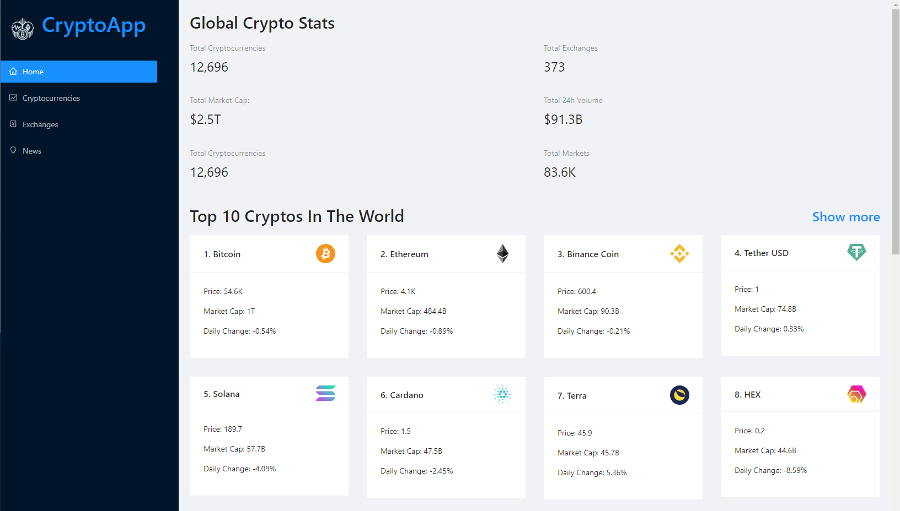

# Covid-19 Tracker - Estudo de Caso



O mesmo tem como objetivo o estudo das tecnólogias abaixo:

## Tecnólogias

ReactJs 
Charts
Consumo de API

## API

Você precisara ter uma conta da Rapidapi.com para pegar as credencias das API

URL: https://rapidapi.com/hub?utm_source=youtube.com%2FJavaScriptMastery&utm_medium=DevRel&utm_campaign=DevRel

URL: https://rapidapi.com/microsoft-azure-org-microsoft-cognitive-services/api/bing-news-search1

URL: https://rapidapi.com/Coinranking/api/coinranking1?utm_source=youtube.com%2FJavaScriptMastery&utm_medium=DevRel&utm_campaign=DevRel

## Instalação

Você precisará ter apenas o [NodeJS](https://nodejs.org) instalado na sua máquina, e após isso, clonar este repositório:
```sh
  $ git clone https://github.com/Bruno-Goudric/cryptoapp.git
```

Depois disso acesse a pasta do projeto que você deseja e instale as dependências executando o seguinte comando:
```sh
  $ yarn install  ou npm install
```

## Executando a aplicação

Execute o comando a baixo para inicializar o Projeto:
```sh
  $ yarn start  ou npm start
```